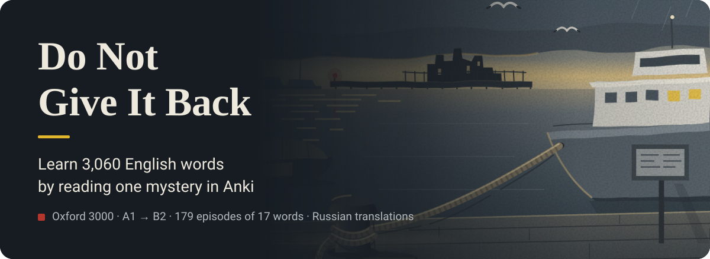
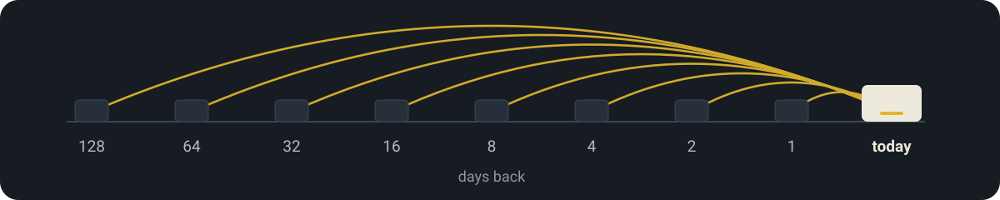
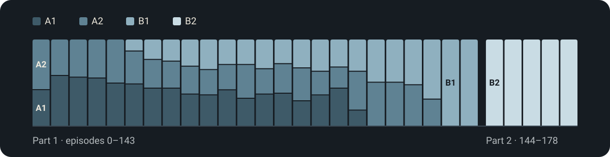

<p align="center">
  
</p>

<p align="center"><a href="./README.md">Русский</a> · <b>English</b></p>

**An Anki deck in which all 3,060 Oxford 3000 words (A1–B2) form one mystery novel.** Learn 15 new words a day and read the story episode by episode.

> **Translations are in Russian.** The deck is made for Russian speakers.

> Tidewell is a rainy port city where people forget their own lives. So everybody writes cards. A grey box, Item 1681, arrives at Lost Property with someone's life inside and a note: "Do not give this back to me. Even if I ask."

<p align="center">
  <a href="#how-to-install"><b>Download the deck</b></a> · <a href="#whats-inside">What's inside</a> · <a href="#the-book">The book</a> · <a href="#settings">Settings</a> · <a href="#faq">FAQ</a>
</p>

## What it looks like

<p align="center">
  
</p>

A screenshot from Anki: a card from episode 3 on a desktop (day) and on a phone (night). More screenshots are in [`assets/readme/cards`](./assets/readme/cards).

## What's inside

### Every card is a fragment of one story

**3,060 words form 179 episodes of 17 words.** Each fragment is styled as a document of the city: a Lost Property log, a police report, a receipt, a night radio show. The plot: Ida from Lost Property tries to find out whose life is in Box 1681.

<p align="center">
  
</p>

1. The word in its fragment — try to understand it first.
2. The document label.
3. The translation, right under the word.
4. A picture of the word.
5. A scene of the place where it happens.
6. The fragment translation — on tap.

### The story brings words back

**A word you learned appears in the plot again after 1, 2, 4 … 128 days** — in another scene, from another character, sometimes with another meaning. More than 1,100 returns in total. It is spaced repetition, like Anki itself.

> Episode 82, Nils's note: "**Important**: bring the biscuits."<br>
> Episode 84, Ida's log: "Why am I worried about you? Not **important**."

<p align="center">
  
</p>

### The level grows with the story

**The first 30 episodes use only A1 and A2**, so you can start from zero. Then B1 joins; Part 2 (episodes 144–178) is B2.

<p align="center">
  
</p>

Words per level: A1 775, A2 876, B1 813, B2 596.

### Pictures for memory

**900 word pictures and 15 place scenes** in one style, with day and night themes. A word with a picture is easier to remember.

<p align="center">
  
</p>

<details>
<summary>All 15 scenes</summary>
<br>
<p align="center">
  
</p>
</details>

## How to install

1. Install Anki: [desktop](https://apps.ankiweb.net) and [Android](https://play.google.com/store/apps/details?id=com.ichi2.anki) are free, [iPhone and iPad](https://apps.apple.com/app/ankimobile-flashcards/id373493387) is paid.
2. Download [`Wordkeep-Oxford-3000.apkg`](https://github.com/phloya/wordkeep/releases/latest/download/Wordkeep-Oxford-3000.apkg) from [Releases](../../releases/latest).
3. Open the file in Anki:
   - **Desktop:** double-click the file or choose File → Import. Enable *Import any deck presets* to get 15 new cards a day.
   - **Android:** open the file and choose AnkiDroid.
   - **iPhone and iPad:** open the file in the Files app, tap Share and choose AnkiMobile.
4. Study in order: new cards follow the story, do not shuffle them.

## The book

**[The book](https://phloya.github.io/wordkeep/book/) shows the episodes you have passed as continuous text, like chapters of a novel.** You do not need it to study.

- It opens in the browser, nothing to install. The interface is in Russian.
- Only the prologue is open at first. When you pass an episode in Anki, press "Открыть: Серия N" (Open: Episode N). No spoilers.
- "перевод" under a card shows its translation; "Весь перевод" shows the whole episode's.
- Progress is kept in the browser and is not linked to Anki.

## Settings

### New words per day

The default is **15**. To change it:

1. Click the gear next to the deck.
2. Choose Options.
3. Type the number in New cards/day.
4. Click Save.

On a phone: Android — long-press the deck; iPhone — open the deck → Options.

### Fix a word or a translation — on a computer

1. Click Browse in Anki's top bar.
2. Find the word with the search.
3. Edit the field on the right; it saves right away.

While studying it is faster: Edit or the `E` key. In the `Example` field change only the text: it also holds the picture and the scene.

### Change how cards look — on a computer

1. Tools → Manage Note Types.
2. "Wordkeep (Oxford 3000)" → Cards….
3. Styling → add a rule at the end. For example, only the word on the front:

```css
.front .ex-story { display: none; }
```

More recipes: [docs/customize.en.md](./docs/customize.en.md). How the deck is built: [docs/how-it-works.en.md](./docs/how-it-works.en.md).

### Move changes to your phone

1. Create a free account at [ankiweb.net](https://ankiweb.net).
2. On the computer, click Sync and sign in.
3. On the phone, sign in to the same account and sync too.

## FAQ

**How do I study?** Study Now → recall the translation → Show Answer (Space) → rate yourself. The rating decides when the word comes back.

| Button (key) | When to press |
| :--- | :--- |
| Again (1) | you did not remember; it comes back in a minute |
| Hard (2) | you remembered with effort |
| Good (3) | you remembered; the usual answer |
| Easy (4) | you knew it at once |

**It shows 20, not 15?** "Import any deck presets" was off during import. Change the number by hand — see [Settings](#settings).

**Does it work offline?** Yes. Without a connection the Google Fonts do not load and the cards fall back to system fonts.

**Can I study on AnkiWeb?** Yes, but you cannot import the deck there: import it on a computer or phone, then sync. AnkiWeb has no text-to-speech; the ▶ button works in Anki desktop and AnkiDroid.

## License and links

- Texts, translations, pictures and design: [CC BY-NC-SA 4.0](./LICENSE.md) — share and adapt non-commercially, with attribution, under the same license.
- Oxford 3000™ is a word list © Oxford University Press. This project is not affiliated with OUP and uses only the words; all texts are original.
- Found a mistake in a text or translation? Open an [issue](../../issues).
- Author: [phloya](https://github.com/phloya).
