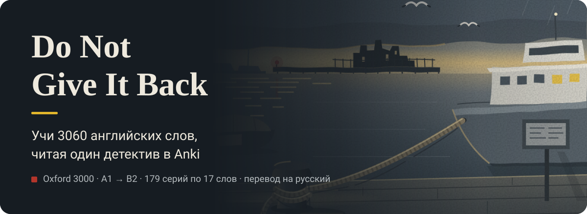
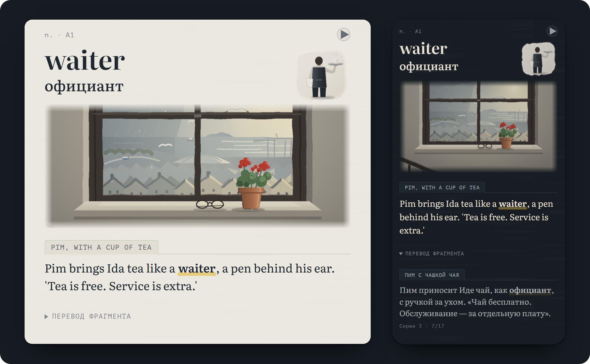
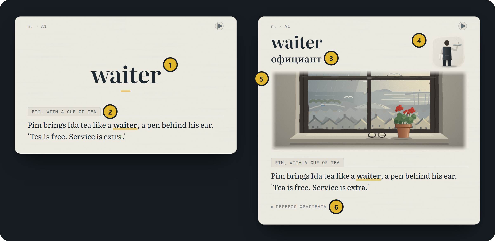
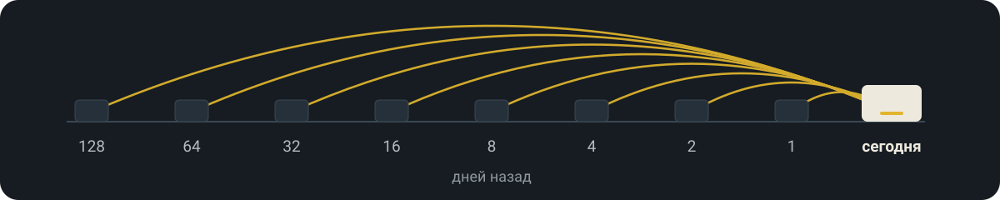
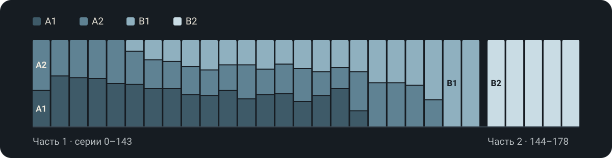
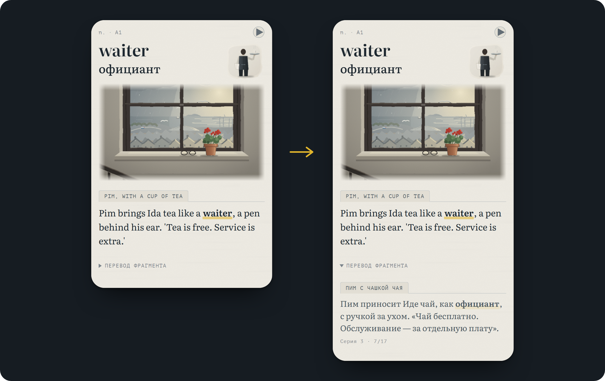
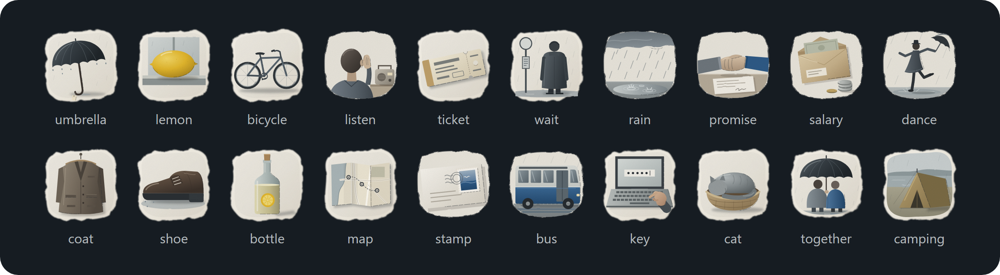
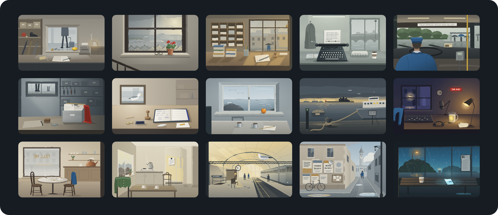

<p align="center">
  
</p>

<p align="center"><b>Русский</b> · <a href="./README.en.md">English</a></p>

**Колода Anki, в которой все 3060 слов Oxford 3000 (A1–B2) складываются в один детективный роман.** Учишь 17 слов в день — читаешь одну серию.

> Тайдвелл — дождливый портовый город, где люди забывают собственную жизнь. Поэтому здесь все пишут карточки. В бюро находок приносят серую коробку №1681 с чужой жизнью внутри и запиской: «Не отдавайте мне это обратно. Даже если я попрошу».

<p align="center">
  <a href="#как-установить"><b>Скачать колоду</b></a> · <a href="#что-внутри">Что внутри</a> · <a href="#книга">Книга</a> · <a href="#как-устроено-и-как-настроить">Для разработчиков</a> · <a href="#вопросы-и-ответы">Вопросы</a>
</p>

## Как это выглядит

<p align="center">
  
</p>

Скриншот из Anki: карточка третьей серии на компьютере (день) и на телефоне (ночь). Другие снимки — в [`assets/readme/cards`](./assets/readme/cards).

## Что внутри

### Каждая карточка — фрагмент одной истории

3060 карточек складываются в 179 серий по 17 новых слов. Фрагмент — одно-два предложения со словом, оформленные как документ города: журнал бюро находок, карточка из коробки, полицейский рапорт, чек, ночной радиоэфир, подслушанный разговор. Слово запоминается вместе со сценой, а продолжение истории — повод открыть колоду завтра.

<p align="center">
  
</p>

1. Слово и фрагмент — сначала попробуй понять сам.
2. Ярлык документа.
3. Перевод сразу под словом.
4. Рисунок слова.
5. Сцена места, где это происходит.
6. Перевод всего фрагмента — по нажатию.

### История сама возвращает слова

В каждую серию вплетены слова из серий, пройденных 1, 2, 4, 8, 16, 32, 64 и 128 дней назад, — всего больше 1100 возвращений. Anki повторяет карточку, а история — само слово, в новой сцене и рядом с новыми словами (интервальное повторение).

<p align="center">
  
</p>

### Уровень растёт вместе с историей

Первые 30 серий — только слова A1 и A2, поэтому можно начинать с нуля. Потом добавляется B1, и к концу первой части (серия 143) остаётся только он. Вторая часть, серии 144–178, — B2.

<p align="center">
  
</p>

Всего слов: A1 — 775, A2 — 876, B1 — 813, B2 — 596.

### Сначала понять, потом подсмотреть

Перевод фрагмента свёрнут: сначала разбираешь английский сам, потом проверяешь себя. Так запоминается крепче (эффект проверки).

<p align="center">
  
</p>

### Картинки для памяти

900 рисунков к словам и 15 сцен мест в одном стиле, есть дневная и ночная тема. Слово с картинкой запоминается лучше (двойное кодирование).

<p align="center">
  
</p>

<details>
<summary>Все 15 сцен</summary>
<br>
<p align="center">
  
</p>
</details>

## Как установить

1. Поставь Anki: [на компьютер](https://apps.ankiweb.net) и [на Android](https://play.google.com/store/apps/details?id=com.ichi2.anki) — бесплатно, [на iPhone и iPad](https://apps.apple.com/app/ankimobile-flashcards/id373493387) — платно.
2. Скачай [`Do-Not-Give-It-Back-Oxford-3000.apkg`](https://github.com/phloya/oxford-3000-detective/releases/latest/download/Do-Not-Give-It-Back-Oxford-3000.apkg) из [Releases](../../releases/latest).
3. Открой файл в Anki:
   - **Компьютер:** дважды щёлкни по файлу или выбери «Файл → Импорт» (File → Import). Включи импорт пресетов колод (Import deck presets) — будет 17 новых карточек в день.
   - **Android:** открой файл и выбери AnkiDroid.
   - **iPhone и iPad:** открой файл в приложении «Файлы», нажми «Поделиться» и выбери AnkiMobile.
4. Учи по порядку: новые карточки идут по сюжету, не перемешивай их.

## Книга

[Книга](https://phloya.github.io/oxford-3000-detective/book/) — сайт, где серии колоды собраны в сплошной текст, чтобы перечитать пройденное подряд, как роман. Для учёбы она не обязательна.

- Открывается в браузере, ставить ничего не нужно.
- Сначала открыт только пролог. Прошёл следующую серию в Anki — нажми внизу «Открыть: Серия N». Остальные серии закрыты, чтобы не было спойлеров.
- Кнопка «перевод» под карточкой показывает перевод фрагмента, «Весь перевод» — перевод всей серии.
- Открытые серии запоминаются в этом браузере. С Anki книга не связана: на другом устройстве серии нужно открыть заново.

## Как устроено и как настроить

- Тип записи «Do Not Give It Back (Oxford 3000)» с полями `Word`, `POS`, `Level`, `Translation`, `Example`, `ExampleRU`.
- В `Example` фрагмент хранится как HTML: ярлык документа, текст со словом в `<b>`, сцена и рисунок. В `ExampleRU` — перевод и номер серии.
- Шаблоны и стиль лежат в [`docs/template`](./docs/template). Сцены встроены в CSS колоды, рисунки — медиафайлы `tw_*.svg`.
- Подробно: [как устроена колода](./docs/how-it-works.md) и [настройка под себя](./docs/customize.md). Например, оставить на лицевой стороне только слово:

```css
.front .ex-story { display: none; }
```

## Вопросы и ответы

**Работает без интернета?** Да. Без сети не загрузятся шрифты из Google Fonts, и карточки покажутся системными шрифтами.

**Можно учиться в AnkiWeb?** Да, но импортировать колоду туда нельзя: импортируй на компьютере или телефоне и синхронизируй. Озвучки в AnkiWeb нет, кнопка ▶ работает в Anki на компьютере и в AnkiDroid.

## Лицензия и ссылки

- Тексты, переводы, рисунки и оформление — [CC BY-NC-SA 4.0](./LICENSE.md): можно делиться и переделывать некоммерчески, с указанием автора и под той же лицензией.
- Oxford 3000™ — список слов © Oxford University Press. Проект не связан с OUP; из списка взяты только слова, все тексты оригинальные.
- Нашёл ошибку в тексте или переводе — открой [Issue](../../issues).
- Автор — [phloya](https://github.com/phloya).
